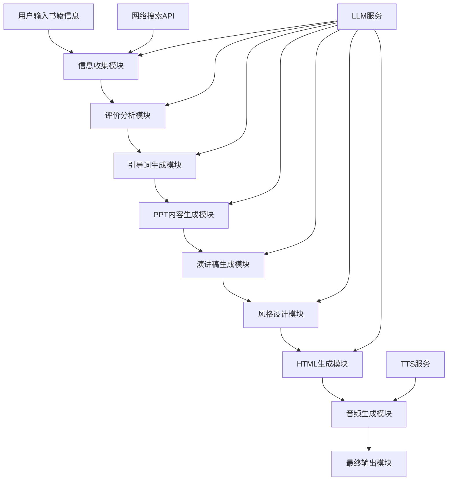

# 书籍介绍系统设计文档

## 概述

书籍介绍系统是对现有Fogsight动画生成应用的重大改造，将其转换为一个智能的书籍介绍内容生成平台。系统采用多阶段处理流程，从书籍信息收集到最终HTML演示文稿输出，每个阶段都有明确的输入输出和处理逻辑。

## 架构

### 整体架构图



### 系统分层

1. **表现层 (Presentation Layer)**
   - Web界面 (HTML/CSS/JavaScript)
   - 用户交互组件
   - 进度显示和状态反馈

2. **业务逻辑层 (Business Logic Layer)**
   - 流程编排器 (Process Orchestrator)
   - 各阶段处理器 (Stage Processors)
   - 内容生成器 (Content Generators)

3. **服务层 (Service Layer)**
   - LLM集成服务
   - 网络搜索服务
   - 文本转语音服务
   - 文件处理服务

4. **数据层 (Data Layer)**
   - 会话状态管理
   - 临时文件存储
   - 配置管理

## 组件和接口

### 核心组件

#### 1. 流程编排器 (ProcessOrchestrator)

```python
class ProcessOrchestrator:
    def __init__(self):
        self.stages = [
            BookInfoCollector(),
            ReviewAnalyzer(), 
            GuidewordGenerator(),
            PPTContentGenerator(),
            SpeechGenerator(),
            StyleDesigner(),
            HTMLGenerator(),
            AudioGenerator(),
            OutputProcessor()
        ]
    
    async def process_book_introduction(self, book_info: BookInfo) -> BookIntroductionResult:
        context = ProcessContext(book_info)
        for stage in self.stages:
            context = await stage.process(context)
            yield StageResult(stage.name, context.current_output)
        return context.final_result
```

#### 2. 书籍信息收集器 (BookInfoCollector)

```python
class BookInfoCollector:
    async def process(self, context: ProcessContext) -> ProcessContext:
        # 收集书籍基本信息
        book_info = context.book_info
        
        # 搜索网络评价
        reviews = await self.search_reviews(book_info)
        
        # 结构化整理信息
        structured_info = await self.structure_information(book_info, reviews)
        
        context.structured_info = structured_info
        return context
    
    async def search_reviews(self, book_info: BookInfo) -> List[Review]:
        # 使用搜索API或LLM生成模拟评价
        pass
    
    async def structure_information(self, book_info: BookInfo, reviews: List[Review]) -> StructuredInfo:
        # 使用LLM整理和分类信息
        pass
```

#### 3. 引导词生成器 (GuidewordGenerator)

```python
class GuidewordGenerator:
    async def process(self, context: ProcessContext) -> ProcessContext:
        prompt = self.build_guideword_prompt(context.structured_info)
        guidewords = await self.llm_service.generate(prompt)
        context.guidewords = guidewords
        return context
    
    def build_guideword_prompt(self, info: StructuredInfo) -> str:
        return f"""
        基于以下书籍信息和评价，生成PPT制作的引导词：
        
        书籍信息：{info.book_details}
        网络评价：{info.reviews_summary}
        
        请生成包含以下要素的引导词：
        1. 核心主题和关键观点
        2. 目标受众分析
        3. 推荐理由和亮点
        4. 内容结构建议
        """
```

#### 4. PPT内容生成器 (PPTContentGenerator)

```python
class PPTContentGenerator:
    async def process(self, context: ProcessContext) -> ProcessContext:
        slides_structure = await self.generate_slides_structure(context.guidewords)
        slides_content = await self.generate_slides_content(slides_structure, context.structured_info)
        context.ppt_content = slides_content
        return context
    
    async def generate_slides_structure(self, guidewords: str) -> SlidesStructure:
        # 生成PPT的整体结构
        pass
    
    async def generate_slides_content(self, structure: SlidesStructure, info: StructuredInfo) -> SlidesContent:
        # 为每一页生成具体内容
        pass
```

#### 5. 演讲稿生成器 (SpeechGenerator)

```python
class SpeechGenerator:
    async def process(self, context: ProcessContext) -> ProcessContext:
        speech_scripts = []
        for slide in context.ppt_content.slides:
            script = await self.generate_slide_speech(slide, context.structured_info)
            speech_scripts.append(script)
        context.speech_scripts = speech_scripts
        return context
    
    async def generate_slide_speech(self, slide: Slide, info: StructuredInfo) -> SpeechScript:
        # 为单个幻灯片生成演讲稿
        pass
```

#### 6. HTML生成器 (HTMLGenerator)

```python
class HTMLGenerator:
    async def process(self, context: ProcessContext) -> ProcessContext:
        html_template = await self.select_template(context.style_config)
        html_content = await self.generate_html(
            context.ppt_content,
            context.speech_scripts,
            html_template
        )
        context.html_content = html_content
        return context
    
    async def generate_html(self, content: SlidesContent, scripts: List[SpeechScript], template: HTMLTemplate) -> str:
        # 生成完整的HTML PPT代码
        pass
```

#### 7. 音频生成器 (AudioGenerator)

```python
class AudioGenerator:
    async def process(self, context: ProcessContext) -> ProcessContext:
        audio_files = []
        for script in context.speech_scripts:
            audio_data = await self.text_to_speech(script.text)
            audio_files.append(audio_data)
        context.audio_files = audio_files
        return context
    
    async def text_to_speech(self, text: str) -> AudioData:
        # 调用TTS服务生成音频
        pass
```

### 数据模型

#### 核心数据结构

```python
@dataclass
class BookInfo:
    title: str
    author: str
    isbn: Optional[str] = None
    genre: Optional[str] = None
    publication_year: Optional[int] = None
    description: Optional[str] = None

@dataclass
class Review:
    source: str
    rating: float
    content: str
    date: datetime
    reviewer: str

@dataclass
class StructuredInfo:
    book_details: BookInfo
    reviews_summary: str
    key_themes: List[str]
    target_audience: str
    strengths: List[str]
    criticisms: List[str]

@dataclass
class Slide:
    title: str
    content: str
    visual_elements: List[str]
    layout_type: str

@dataclass
class SpeechScript:
    slide_id: str
    text: str
    duration_estimate: float
    emphasis_points: List[str]

@dataclass
class ProcessContext:
    book_info: BookInfo
    structured_info: Optional[StructuredInfo] = None
    guidewords: Optional[str] = None
    ppt_content: Optional[SlidesContent] = None
    speech_scripts: Optional[List[SpeechScript]] = None
    style_config: Optional[StyleConfig] = None
    html_content: Optional[str] = None
    audio_files: Optional[List[AudioData]] = None
    final_result: Optional[BookIntroductionResult] = None
```

### API接口设计

#### 主要端点

```python
# 新的书籍介绍生成端点
@app.post("/generate-book-introduction")
async def generate_book_introduction(request: BookIntroductionRequest):
    """
    生成书籍介绍PPT
    """
    pass

# 获取生成进度
@app.get("/generation-status/{session_id}")
async def get_generation_status(session_id: str):
    """
    获取生成进度和当前阶段信息
    """
    pass

# 下载最终结果
@app.get("/download-result/{session_id}")
async def download_result(session_id: str):
    """
    下载生成的HTML文件和相关资源
    """
    pass
```

#### 请求/响应模型

```python
class BookIntroductionRequest(BaseModel):
    book_title: str
    author: str
    isbn: Optional[str] = None
    additional_info: Optional[str] = None
    style_preference: Optional[str] = "professional"
    language: str = "zh"

class GenerationProgress(BaseModel):
    session_id: str
    current_stage: str
    progress_percentage: float
    stage_output: Optional[str] = None
    estimated_remaining_time: Optional[int] = None

class BookIntroductionResult(BaseModel):
    session_id: str
    html_content: str
    audio_files: List[str]
    metadata: Dict[str, Any]
    download_url: str
```

## 错误处理

### 错误类型和处理策略

1. **网络搜索失败**
   - 降级策略：使用LLM生成模拟评价
   - 用户提示：告知使用了模拟数据

2. **LLM服务不可用**
   - 重试机制：指数退避重试
   - 降级策略：使用缓存的模板内容

3. **TTS服务失败**
   - 降级策略：提供纯文本版本
   - 用户选择：允许用户跳过音频生成

4. **内容生成质量问题**
   - 验证机制：内容长度和格式检查
   - 重新生成：自动重试或用户手动重试

### 错误恢复机制

```python
class ErrorHandler:
    async def handle_stage_error(self, stage: str, error: Exception, context: ProcessContext) -> ProcessContext:
        if stage == "review_collection":
            return await self.fallback_to_simulated_reviews(context)
        elif stage == "audio_generation":
            return await self.skip_audio_generation(context)
        else:
            raise error
    
    async def fallback_to_simulated_reviews(self, context: ProcessContext) -> ProcessContext:
        # 使用LLM生成模拟评价
        pass
    
    async def skip_audio_generation(self, context: ProcessContext) -> ProcessContext:
        # 跳过音频生成，提供纯文本版本
        pass
```

## 测试策略

### 单元测试

- 每个处理器组件的独立测试
- 数据模型的验证测试
- LLM提示词的效果测试

### 集成测试

- 端到端流程测试
- 不同书籍类型的测试用例
- 错误场景的处理测试

### 性能测试

- 大量并发请求的处理能力
- 长时间运行的稳定性
- 内存使用和资源清理

### 测试数据

```python
TEST_BOOKS = [
    BookInfo(title="三体", author="刘慈欣", genre="科幻小说"),
    BookInfo(title="百年孤独", author="加西亚·马尔克斯", genre="魔幻现实主义"),
    BookInfo(title="人类简史", author="尤瓦尔·赫拉利", genre="历史"),
]
```

## 部署和扩展

### 部署架构

- 容器化部署 (Docker)
- 负载均衡和水平扩展
- 静态资源CDN分发
- 数据库集群 (如需要持久化)

### 监控和日志

- 应用性能监控 (APM)
- 错误追踪和报警
- 用户行为分析
- 资源使用监控

### 扩展性考虑

- 支持更多书籍信息源
- 多语言支持扩展
- 自定义模板系统
- 插件化的处理器架构